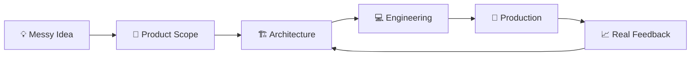

<div align="center">

# 👋 Azeem Akram ⚡

### Building production apps, SaaS platforms, AI workflows & clean technical systems 🚀

**Technical Lead** 🧠 | **Solution Architect** 🏗️ | **Mobile + Web + Backend Engineer** 💻

<br />

<a href="https://www.linkedin.com/in/azeemakram">
  
</a>
<a href="https://www.upwork.com/freelancers/azeemakram1">
  
</a>
<a href="https://calendly.com/azeemse517/30min">
  
</a>
<a href="mailto:azeemse517@gmail.com">
  
</a>

<br /><br />


</div>

---

## 🎧 My Dev Mode

```txt
🧠 Thinking in systems
📱 Shipping mobile apps
🌐 Building web platforms
⚙️ Designing backend APIs
☁️ Deploying production infra
🤖 Adding AI where it creates real value
🚀 Turning rough ideas into software people actually use
```

I am **Azeem Akram**, a **Technical Lead, Solution Architect, and hands-on product engineer** with **15+ years of experience** building commercial software across mobile apps, web platforms, backend systems, SaaS products, cloud infrastructure, and AI-powered workflows.

Most of my serious work lives inside **private repositories** because it belongs to clients, commercial products, internal platforms, and production businesses. So this profile is not an open-source trophy wall. It is my technical front door.

---

## 🧠 My Vibe Statement

🛠️ + 🧩 + 🚀 = **Practical Product Engineering**

I do not just write code. I take business requirements, cut through the noise, design the system, build the core, guide execution, and ship the product.

My strongest zone is where **product thinking, architecture, hands-on engineering, and delivery leadership** meet.

---

## 🚀 Tech Stack & Arsenal

My toolkit for building, scaling, debugging, shipping, and keeping products alive:

<p align="center">
  
</p>

<p align="center">
  
  
  
  
  
  
  
</p>

---

## 📊 Commercial Stats & Signal

<div align="center">

<table>
<tr>
<td align="center" width="25%">
<h3>15+</h3>
<p>Years Experience</p>
</td>
<td align="center" width="25%">
<h3>50+</h3>
<p>Client Jobs</p>
</td>
<td align="center" width="25%">
<h3>100%</h3>
<p>Job Success</p>
</td>
<td align="center" width="25%">
<h3>Top Rated</h3>
<p>Upwork Talent</p>
</td>
</tr>
</table>

</div>

The public commit graph does not tell the full story because the real work is mostly private: client-owned repositories, SaaS products, internal tools, mobile apps, backend systems, AI workflows, and production infrastructure.

That is normal in commercial software. I am not here to fake contribution farming.

---

## 🧩 Systems & Quests

- 📱 **Mobile Apps:** React Native, Flutter, Swift, Firebase, push notifications, offline-first flows, app store deployment  
- 🌐 **Web Platforms:** React.js, Next.js, TypeScript, Tailwind, admin panels, SaaS dashboards, responsive interfaces  
- ⚙️ **Backend Systems:** Node.js, Laravel, REST APIs, auth, RBAC, reporting engines, multi-tenant logic  
- ☁️ **Cloud & DevOps:** AWS EC2, S3, RDS, Nginx, PM2, SSL, production deployment, server management  
- 🤖 **AI Workflows:** OpenAI APIs, AI reports, automation, document intelligence, AI-powered product features  
- 🧭 **Technical Leadership:** Architecture, feasibility, scope, planning, execution, infrastructure, trade-offs  

---

## 🛠️ Build Path



> Build what matters first. Keep architecture practical. Ship usable versions. Improve from real users.

---

## 🏆 Selected Private Work

Due to client confidentiality, most production repositories cannot be public. The work includes:

- 🏗️ SaaS platforms and admin dashboards  
- 📱 Mobile apps for marketplaces, events, wellness, logistics, and field operations  
- 🧾 Reporting and PDF-generation systems  
- 🔐 Multi-role and organization-based access systems  
- 🤖 AI-assisted reports and OpenAI-powered workflows  
- ☁️ AWS-backed backend systems and production deployments  
- 🔄 Offline-first mobile sync patterns  
- 💳 Subscription and payment-enabled platforms  

---

## 🎯 Mission & Endgame

🧠 **Current Mode:** Building stronger AI-powered product workflows and scalable SaaS systems.  
🚀 **Main Quest:** Turn practical business problems into clean, production-ready software.  
⚔️ **Side Quest:** Help founders and teams avoid messy development decisions that become expensive later.  

---

## ⚡ Strong Fit

I create the most value when the work needs:

- Founder-level product thinking  
- Mobile, web, and backend architecture  
- AI features added into real products  
- MVP-to-production execution  
- Technical leadership without corporate fluff  
- A practical engineer who can think, build, ship, and lead  

---

## 📌 Public Repo Direction

The plan for this GitHub is to publish selected technical samples and architecture patterns from my real experience:

- `mobile-ai-feature-starter` — AI feature integration pattern for existing mobile apps  
- `saas-admin-dashboard-architecture` — Multi-tenant SaaS architecture thinking  
- `offline-first-mobile-sync-pattern` — Field app sync and offline workflows  
- `react-native-production-checklist` — Practical mobile release checklist  
- `node-api-boilerplate` — Backend structure for real systems  
- `ai-report-generator-demo` — AI-assisted report generation workflow  

---

## 🤝 Let’s Build

Ready to talk product, architecture, mobile apps, SaaS, backend, cloud, or AI?

<p align="center">
  <a href="https://www.linkedin.com/in/azeemakram">
    
  </a>
  <a href="https://www.upwork.com/freelancers/azeemakram1">
    
  </a>
  <a href="https://calendly.com/azeemse517/30min">
    
  </a>
  <a href="mailto:azeemse517@gmail.com">
    
  </a>
</p>

<div align="center">

<br />

**Azeem Akram**  
`Technical Lead` · `Solution Architect` · `Product Engineer`

</div>
